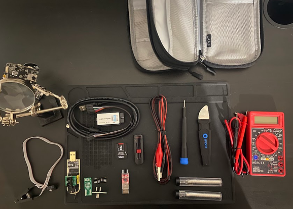

# IoT-Workbench
My personal toolkit for exploring, analyzing, and hacking IoT devices.  

- Thinkpad x250  
- Digital Multimeter(DMM)     
- iFixit screwdriver  
- Soldering Mat 
- Dupont cables    
- Jumper cables   
- Micro SD Card Reader  
- USB-UART adapter   
- Logic Analyzer   
- Flash Programmer  
- Pinecil v2 Soldering Iron(not shown)
- 3rd Hand  
- Tool Pouch/organizer 

 

